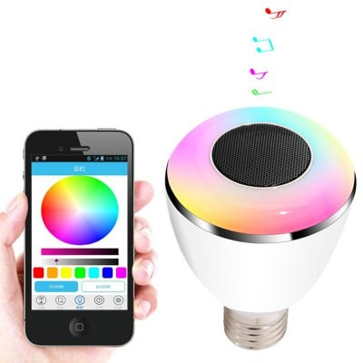
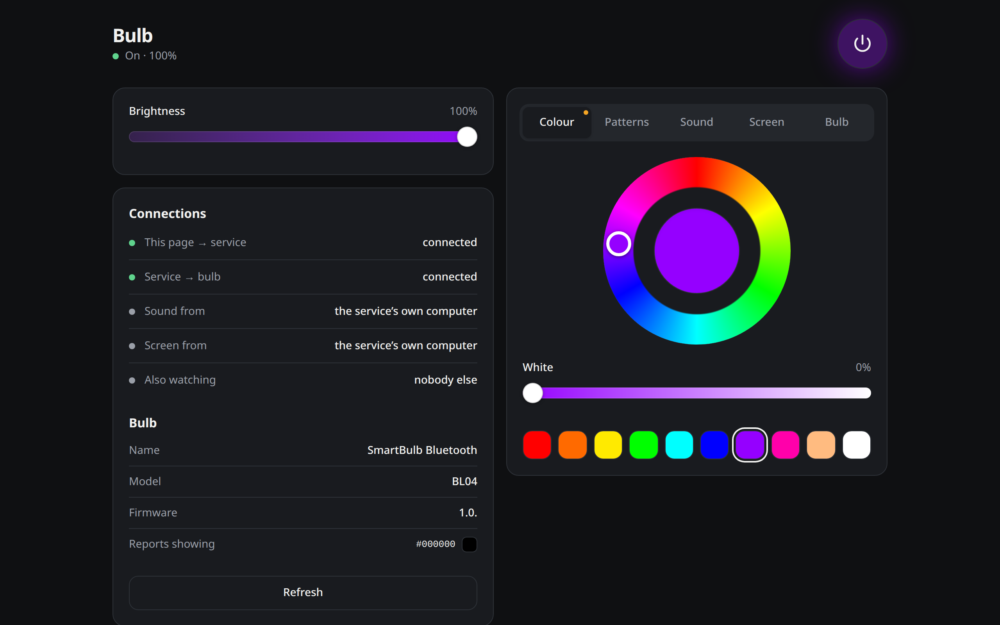
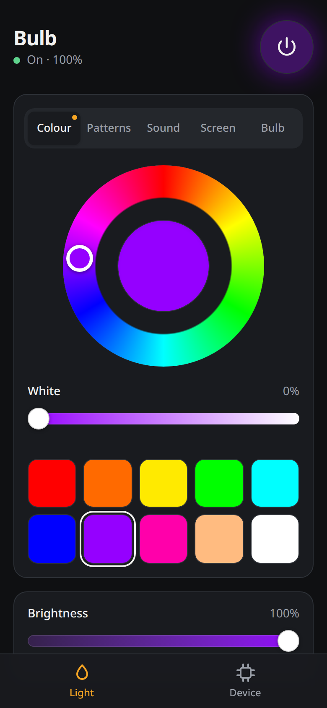
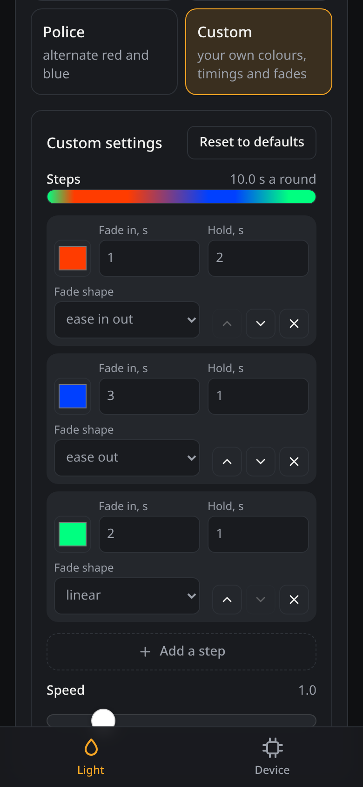
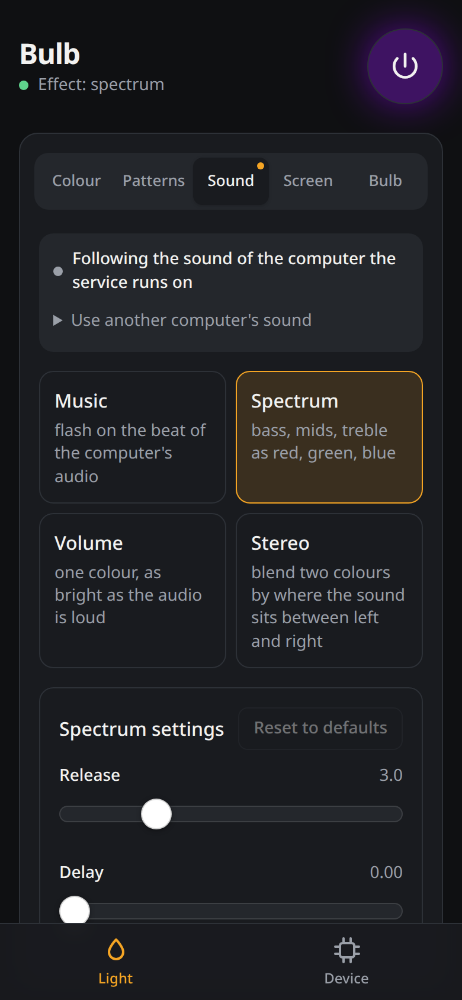
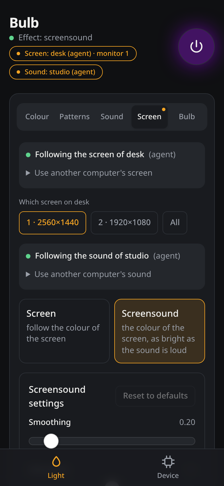

# chsmartbulb



Control the CHSmartBulb / BL08A Bluetooth speaker bulb from a computer, without the vendor app.

The vendor app (CHSmartBulb) no longer runs on current phones, which leaves these bulbs stuck on
whatever colour they had last. This project replaces it: an app for Android, Linux and Windows, a
background service with a web interface, a command line tool and a Python library, all built on
the bulb's protocol, which was worked out and documented here.

## What works

- RGB colour, the separate white LEDs, brightness, on/off, soft fades
- The 13 effects built into the bulb, including its sound-reactive mode
- 28 more effects, generated on the computer or phone and streamed to the bulb: patterns from a
  candle to a thunderstorm and a sunrise, a step editor for your own, twelve that follow the
  music, and four that follow the colour of a screen
- A sleep timer that dims whatever is showing and then switches it off
- A background service (`chsmartbulbd`, one Rust program for Linux and Windows) that keeps the
  connection, runs effects and restores the light when the bulb comes back after losing power
- A web interface served by that service, for phones and other computers on the network
- An app for Android, Linux and Windows that needs nothing else running
- Control from other machines on the network, with agents so the light can follow the music or
  the screen of a computer that has no Bluetooth
- Dimming or switching off while the computer is locked or asleep
- Reading the name, model, colour and stored timers; enabling and disabling timers
- Bluetooth Classic (RFCOMM) and BLE transports

Colour temperature is not supported by the hardware.

## The interface

The app and the page that `chsmartbulbd --web 8378` serves are the same interface: the light is in
one of five modes (a colour, a pattern, the sound, the screen, an effect of the bulb's own), and
the page says whose sound or screen it follows.

<p>
  
</p>
<p>
  
  
  
  
</p>

## What is in here

| | |
|---|---|
| The app ([docs/app.md](docs/app.md)) | Android, Linux, Windows. Talks to the bulb itself over BLE or Bluetooth Classic, so a phone drives it with nothing else running, and can follow what the phone plays. |
| `chsmartbulbd` ([docs/usage.md](docs/usage.md#background-service)) | The background service for a computer, Linux or Windows: holds the bulb, plays the effects, serves the web interface and takes other machines in. |
| `chsmartbulb` ([docs/usage.md](docs/usage.md#command-line)) | The command line, in Python: drives a service, here or on another machine, or the bulb itself; also the agents that send a computer's sound or screen to a service. |
| The Python library ([docs/usage.md](docs/usage.md#library)) | The bulb from your own code. |
| The protocol ([docs/protocol.md](docs/protocol.md)) | What the bulb understands, for anyone writing their own. |

The service, the effects and the protocol are written once, in Rust ([`crates/core`](crates/core)),
and the app, `chsmartbulbd` and the Python package all use that one implementation.

## Install

Every [release](https://github.com/mertemr/chsmartbulb/releases) carries the app (an APK, Linux
packages, Windows installers), `chsmartbulbd` for Linux and Windows, and the Python package as a
wheel. Bluetooth Classic needs the bulb paired first; BLE does not.

The command line needs Python 3.10 or newer:

```bash
pip install "chsmartbulb @ git+https://github.com/mertemr/chsmartbulb"
```

That is enough to drive a service and, with the `audio` or `screen` extra, to run an agent, on
Linux and Windows alike. Reaching the bulb without a service needs Linux with BlueZ and a Python
with Bluetooth sockets (the `ble` extra adds the BLE transport), and playing effects without one
needs [`chsmartbulb-native`](crates/python), the Rust core as a Python module.

From a checkout, with Rust and [uv](https://docs.astral.sh/uv/):

```bash
git clone https://github.com/mertemr/chsmartbulb.git
cd chsmartbulb
cargo build --release -p chsmartbulb-daemon   # the service, target/release/chsmartbulbd
uv sync                                       # the command line, as `uv run chsmartbulb`
uv pip install ./crates/python                # optional: chsmartbulb-native
```

Python builds downloaded by `uv` are compiled without Bluetooth sockets, so the project is set up
to use the system interpreter.

## Quick start

```bash
mkdir -p ~/.config/chsmartbulb
echo CHSMARTBULB_ADDRESS=AA:BB:CC:DD:EE:FF > ~/.config/chsmartbulb/config
chsmartbulbd --web 127.0.0.1:8378 --no-token &   # the service; the page is at http://localhost:8378
chsmartbulb color red
chsmartbulb rgb 0 80 255 --brightness 40 --fade
chsmartbulb effect hue --period 10
chsmartbulb effect music
```

The commands go through the service: they return at once, effects keep playing, and the light
state is remembered. To open the page to the network, give the service a token
([docs/usage.md](docs/usage.md#other-machines)). Without a service the command line talks to the
bulb itself, one connection per command.

The library:

```python
import asyncio
from chsmartbulb import ChSmartBulb, Color, effects

async def main():
    async with ChSmartBulb.rfcomm("AA:BB:CC:DD:EE:FF") as bulb:
        await bulb.set_rgb(255, 0, 100)
        await bulb.set_brightness(0.4)
        await effects.play(bulb, lambda t: Color.from_hsv(36 * t), duration=20)

asyncio.run(main())
```

More in [docs/usage.md](docs/usage.md).

## How it was worked out

The bulb is a dual-mode device. It is controlled through a serial port service on Bluetooth
Classic, and the same frames also work over two BLE characteristics that earlier write-ups had
dismissed as dummies. Every claim in the protocol document was checked on a real bulb, with the
light measured by a webcam, and is marked as measured, read back, or only seen in someone else's
capture.

- [docs/usage.md](docs/usage.md): the service, the command line, the effects, the library
- [docs/app.md](docs/app.md): the app
- [docs/protocol.md](docs/protocol.md): frame format, commands, effects, open questions
- [docs/device.md](docs/device.md): services, connection behaviour, BLE on Linux
- [docs/research.md](docs/research.md): the experiments and the guesses that turned out wrong
- [research/](research): the scripts and raw results behind the above

## Tests

```bash
cargo test --workspace
uv run pytest
pnpm --dir web test
```

The tests need no hardware; they run against a simulated bulb that behaves like the real one.

## Credits

Earlier work on these bulbs that this project started from:
[pfalcon/Chsmartbulb-led-bulb-speaker](https://github.com/pfalcon/Chsmartbulb-led-bulb-speaker),
[samsam2310/Bluetooth-Chsmartbulb-Python-API](https://github.com/samsam2310/Bluetooth-Chsmartbulb-Python-API),
[rafaelbiasi/ChSmartBulbAPI](https://github.com/rafaelbiasi/ChSmartBulbAPI) and
[roelderickx/bluetooth-smartbulb](https://github.com/roelderickx/bluetooth-smartbulb).

The picture of the bulb is the sellers' product picture, as kept in the first and third of those
repositories. The screenshots are of the web interface driving a simulated bulb
(`chsmartbulbd --simulate`).

## License

MIT
